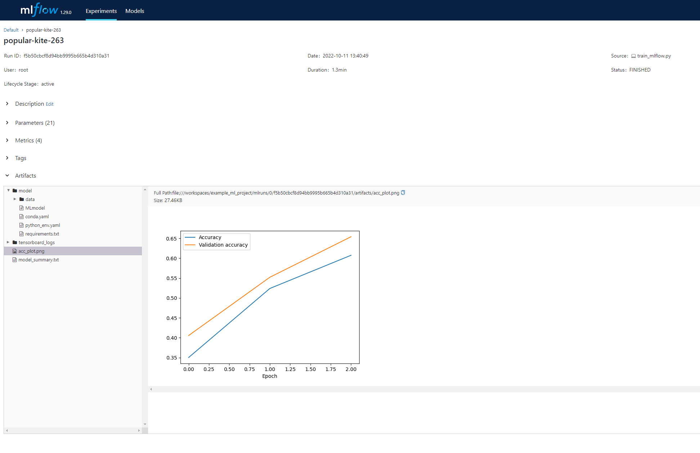

# Introduction
The goal of this repository is to provide an example of how an ML repo can be organised. The focus is to make any experiment a) reproducible and b) make it convinient to acces earlier results. The following aspects influence the reproducibility:

- Data. Using different data for training and/or validation leads to a different result. Using a version control system such as Git is only feasible for very small datasets, for large datasets a good database that support versioning is needed. Alternatively, for a relatively static dataset a simpler scheme using for example different folders might be sufficient. Fixing the data problem is not in scope of this particular repo, we assume that the data is correct and static from the pov of the repo. 
- Software. Different versions of say Keras will lead to different outcomes. The repo fixes this by using a docker container to run the software in. In the Dockerfile we can exactly specify which versions of the software should be loaded. This makes reproducing the exact software environment feasible as long as the base containers and libraries can be loaded. For really long term reproducibility you could opt to build the container and store this explicity. Although you might want to go for an actual container registry system at that stage. 
- Training configuration. Different settings for number of layers, number of neurons, hyperparameter settings, etc will influence the outcome you get. Fortunately, these settings are stored in code. So if you store that code correctly (e.g. in `train.py`), this should ensure reproducibility in combination with the environment we already have from the container. 

So, given the data the experiement can be repeated using a system that runs docker using the dockerfile and the train.py file. Changes over time can be saved using git commits, making it possible to trace the changes over time. However, this is probably not a very good solution when the number of trial-and-error gets really big. You could lose track of which things you already tried, especially when you transfer the experiment to someone else to work on. Here, a system such as MLflow probably makes a lot of sense. 

The following files can be found in the repo template:

- `docker` this folder contains the docker file to build the container needed to run the experiment.
- `.devcontainer.json` Visual Studio Code will pick up this file when loading the repo locally using VS Code. This will automatically load the appropriate VS Code packages, launch the docker container and start Jupyter Notebook. 
- `train.py` the training script that is used to train the model when running from the CLI when running on a server. 
- `train_mlflow.py` training a model, but including tracking of experiment settings using MLFlow. 

# Working with the repository
This repo assumes that it will be used simultaneously in two environments:

- A local computer. To run simpler experiments, explore larger runs that are finished and write down the results. Here we rely on VS Code. 
- A remote linux server where the bulk of the training will take place. This will exclusively be run using the command line (CLI). 

Running locally and remotely should be on the same environment, thus the container setup comes in handy. 

## Locally using VS Code
The use case here is more interactive use as the local GPU is bound to be less powerful than the remote one. Information regarding containers and VS Code in general [can be found here](https://code.visualstudio.com/docs/remote/containers), general information regarding Juptyter notebooks in VS Code [can be found here](https://code.visualstudio.com/docs/datascience/jupyter-notebooks), and a concrete handson tutorial [can be found here](https://decodedbytes.medium.com/create-a-machine-learning-environment-using-vs-code-remote-containers-38c4b7d56c89). 

To get started, just clone the folder and open it with VS Code, if you have the Remote Containers plugin installed the editor should ask you to reopen the directory in the container. After reopening the folder in the container, your lower left statusbar should show:

When using Jupyter Notebooks you need to make sure the kernel attaches to the container and not a local kernel. To chec this, first open a notebook file (`.ipynb`) and on the lower righthand side the statusbar should show:

If not, click on it and select the remote option. This will open a dialog window on the top that asks you to point to the remote jupyter instance running in the container. The way our container is setup, this URL is `http://127.0.0.1:8888/?token=jupdevtoken`. I use a simply password here to authenticate to the instance, so exposing this container to the outside world is probably a bad idea. 

## Remotely via CLI on a server
Here I assume you have ssh access to the remote server, and you know how to set this up. Once you login to the server, use git clone to get this repository. Typically, on a server I train my models using a script. Any artifacts I want to be able to access later then need to be dumped to disk for later inspection. 

To actually run the scripts in the container we use the following docker commands:

    docker build -t example_ml docker
    docker run --gpus all -v ${PWD}:/tmp example_ml python train.py

where:
- `-t` is the tag we use to refer to the container. Mind that if you run multiple of these simulteously, you should take care to use a unique tag. 
- `--gpus all` ensures the container has access to all of the GPU's installed in the system. 
- `-v ${PWD}:/tmp` mounts the local working folder inside the container at /tmp. This makes it possible to call the script using `/tmp/train.py`. It is **important** to mount at `/tmp` in the container as in the dockerfile we change the working directory to that folder. If you notice things you save in the python script do not popup outside the container you probably do not set the working directory corractly. 
- If you built the container previously, just running docker run should suffice. 

Note that if you fire up the training script, be sure to launch this in [tmux](https://linuxize.com/post/getting-started-with-tmux/) and [detach](https://tmuxcheatsheet.com/). Otherwise, closing the ssh connection will kill the training proces. 

A helper script, `run_script.bash`, builds the container, starts the container and runs the script you pass to it inside the container. Usage is:

    > run_script.bash <commands to run inside the container>

for example:

    > run_script.bash python train_mlflow.py

runs the example mlflow training. 

# MLFlow
## MLFlow Philosophy
When testing all kinds of network settings (learning rate, number of neurons, etc), it is easy to end up with a working model without later knowing what kind of experiments you did to get there. You can track this all manually in for example a spreadsheet, but luckily tools like [MLFlow](https://mlflow.org/) exist that can help with this. 

## Using MLFlow in a script
We mainly use the Tracking API of MLFlow. This allows you to specify which things MLFlow should track such as fitted models, the accuracy of the model, the learning rate used, etc, etc. After setting up MLFlow you can simply perform any experiment you want, and MLFlow will track the information you requested per experiment. 

For Keras, MLFlow has an autolog function that automatically logs the most obvious parameters and metrics. `train_mlflow.py` shows how we integrate MLFlow into the model training we already defined in `train.py`. Here, in addition to the autolog tracking, we also track a figure that shows the development of the accuracy and val_accuracy over time. 

## Exploring the MLFlow results
MLFlow can store its information in a local database or a full blown track server, but for now we use the default: store files on disk. This information is stored in the `mlruns` subdirectory, which will be created once you run `train_mlflow.py` for the first time. Note that the `mlruns` directory is not stored in git as it balloons in size quite quickly. If you want to transport the mlflow results between machines you can use tools like `rsync` to simply sync between multiple locations. The typical setup would be that you run the experiments on the server, but visualise them using `mlflow` locally. 

The main avenue of visualising the information stored in `mlruns` is to use `mlflow ui` from the command line in the directory where `mlruns` is stored. For convinience, MLFlow is included in the container and the UI can be started using the following command issued inside the container (using the VS Code terminal for example):

    > bash run_mlflow_ui.bash

Note that this does not simply run `mlflow ui`, but also [fixes the artifact path](https://github.com/mlflow/mlflow/issues/3144#issuecomment-782681919) that results from transporting the mlflow results between machines. After running the command you can open your browser and point it to `localhost:5000`. It show a list of experiments:

and if you click on the link under `Created` you get a detailed view of that particular experiment:

# TODO
- Integrate MLFlow for experiment tracking. This makes it a lot easier to track progress over time. When for each experiment you create a new commit in git you could reproduce all the results, this does not make it easy to quickly browse through earlier results. 
    - How much data does MLflow store? Is it feasible to save this is a github repo? **DONE: for realistic models it takes quite some space. So storing this in the github repo is not realistic.**
    - Does MLFlow integrate with frameworks as Keras tuner? 
    - Add other artifacts such as accuracy plots. **DONE: took some additional work as the artifact path was absolute inside the container where the experiment was run, not the container where the mlflow ui runs.**
    - Write a function that summarizes the architecture of a Keras model, and dump this as MLFlow information. Make smart choices how to do this. 
    - Look at MLFlow models, is it worth it to expand to that or just stick to the tracking API? 
    - We could remove the saving of information in `train.py`, we will be relying on MLFlow either way. 
- Look at running everything inside the container. 
	- Means we could ditch tmux
- Do we want to use a container registry? 
- Fix requirements.txt problem, I currently hardcode the packages in the docker file. 
- Kijk naar KerasTuner en andere optim frameworks. 
    - Keras Tuner en MLFlow?
